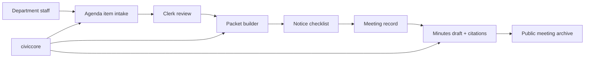

# CivicClerk User Manual

Status: runtime foundation manual  
Version: `0.1.0.dev0`

## Part 1: Non-Technical Overview

### What CivicClerk is

CivicClerk will help city clerks manage the legal record of public
meetings. It is planned to cover agendas, packets, notices, minutes,
votes, motions, ordinances, resolutions, and public meeting archives.

### Who it is for

- city clerks
- deputy clerks
- department staff submitting agenda items
- city attorneys reviewing legal form
- mayors, council members, board members, and commissioners
- residents and journalists viewing public meeting materials

### What a clerk should expect

The product goal is a calm workflow:

1. Create a meeting body.
2. Schedule a meeting.
3. Collect agenda items from departments.
4. Assemble and review the packet.
5. Track notice deadlines.
6. Capture motions and votes.
7. Draft minutes with source citations.
8. Publish approved materials.

Every warning should explain what is wrong and how to fix it. AI may
draft language, but staff remain in control.

### Current status

CivicClerk currently ships a runtime foundation, canonical schema
metadata, Alembic migration scaffolding, and agenda item lifecycle
enforcement. IT staff can import and serve `civicclerk.main:app`, call `/`,
call `/health`, create draft agenda items, and test allowed/rejected agenda
item transitions. Clerks cannot yet create full meetings, packets, notices,
votes, or minutes in the product.

## Part 2: IT and Technical Overview

### Planned deployment model

CivicClerk will follow the CivicSuite deployment pattern:

- local Docker-based deployment
- PostgreSQL 17 + pgvector
- Redis 7.2 + Celery + Celery Beat
- FastAPI backend
- React frontend
- Ollama/Gemma 4 for local LLM inference through `civiccore.llm`, selected by `CIVICCORE_LLM_PROVIDER=ollama`
- no runtime cloud dependency
- no telemetry

### Planned dependency

The runtime foundation pins to civiccore `==0.2.0`.

### Security posture

- Local-first data ownership.
- Role-based access control.
- API-enforced public/private boundaries.
- Audit log for every state transition.
- Closed-session material must never leak into public views.

### Verification

This runtime foundation ships with:

```bash
python -m pytest
bash scripts/verify-docs.sh
python scripts/check-civiccore-placeholder-imports.py
```

Runtime test gates now run in CI. Meeting-workflow tests are added in later milestones.
Milestone 3 adds an agenda item lifecycle test matrix covering every pair
of canonical states. Only direct forward transitions are accepted; invalid
transitions return a 4xx response and record an audit entry.

## Part 3: Architecture Reference

### Planned module boundaries

CivicClerk owns meeting workflows. It should not become:

- electronic voting software
- livestream hosting
- a legal decision-maker
- a full document-management system

### Initial data model sketch

Milestone 2 defines the canonical schema and Alembic migration foundation
for these CivicClerk tables. Milestone 3 adds agenda lifecycle enforcement
for agenda items. It does not ship meeting workflow behavior.

- `meeting_bodies`
- `meetings`
- `agenda_items`
- `staff_reports`
- `motions`
- `votes`
- `public_comments`
- `notices`
- `minutes`
- `transcripts`
- `action_items`
- `packet_versions`
- `ordinances_adopted`
- `closed_sessions`

### Architecture sketch



### First MVP acceptance bar

- Meeting setup works end to end.
- Agenda item intake has loading, empty, success, error, and partial states.
- Notice warnings are actionable.
- Public material clearly labels draft, posted, approved, and archived states.
- Browser QA evidence exists before frontend merges.
