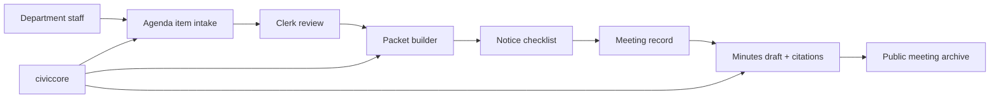

# CivicClerk User Manual

Status: CivicClerk v1.0.3 runtime foundation label is provisional during release recovery
Version: `1.0.3`

## Release Recovery Notice

CivicClerk is not product-ready for public promotion while the CivicSuite
release recovery is active. The current `v1.0.3` recovery patch is the supported release
until the repo passes the recovery gates: full backend tests, frontend tests,
tracked Playwright user-flow tests, WSL runtime install proof, consistency
gates, security scans, docs-source parity, and explicit separation between
mock validation and production deployment. Integration release depth requires
live-wire or in-process boundary validation; mock validation remains local
regression evidence and does not claim that a city production deployment has
occurred.

## Part 1: Non-Technical Overview

### What CivicClerk is

CivicClerk will help city clerks manage the legal record of public
meetings. It is planned to cover agendas, packets, notices, minutes,
votes, motions, ordinances, resolutions, and public meeting archives.

### Who it is for

- city clerks
- deputy clerks
- department staff submitting agenda items
- city attorneys reviewing legal form
- mayors, council members, board members, and commissioners
- residents and journalists viewing public meeting materials

### What a clerk should expect

The product goal is a calm workflow:

1. Create a meeting body.
2. Schedule a meeting.
3. Collect agenda items from departments.
4. Assemble and review the packet.
5. Track notice deadlines.
6. Capture motions and votes.
7. Draft minutes with source citations.
8. Publish approved materials.

Every warning should explain what is wrong and how to fix it. AI may
draft language, but staff remain in control.

### Current status

CivicClerk currently contains a runtime foundation, canonical schema
metadata, Alembic migration scaffolding, agenda item lifecycle enforcement,
meeting lifecycle enforcement, packet snapshot versioning, notice
compliance enforcement, immutable motion capture, immutable vote capture,
action-item capture linked to meeting outcomes, citation-gated minutes
draft capture, and permission-aware public calendar/detail/archive
endpoints, a versioned prompt YAML library registered through
`civiccore.llm.resolve_template` under `consumer_app="civicclerk"`, an offline
evaluation harness for agenda item summaries, staff report normalization,
packet completeness review, notice compliance review, motion/vote summary,
minutes drafting, ordinance/resolution extraction, closed-session safe
refusal, and public plain-language meeting explanation,
local-first connector imports for Granicus, Legistar, PrimeGov, and
NovusAGENDA, no-network vendor live-sync readiness plus durable source/run
ledgering, accessibility/browser QA gates, provisional CivicClerk v1.0.3 release
artifacts, CivicCore 1.2.0 freeze-backed packet export bundles, a database-backed
agenda intake queue with clerk readiness review, database-backed meeting
records with lifecycle audit entries, database-backed packet assembly records
with source/citation metadata, database-backed agenda item lifecycle records
with durable transition audit entries, and database-backed notice
checklist/posting-proof records.
CC-7 now adds a published OpenAPI artifact at `docs/api/openapi.json`, generated
from the live FastAPI app, and direct React QA routes for all 20 spec frontend
pages. New API surfaces cover staff report normalization, transcript capture,
ordinance/resolution handoff, public comment review, admin configuration, and
prompt-library administration. Browser evidence in
`docs/browser-qa/cc7-api-frontend-completeness-qa-2026-05-06.json` covers all
20 pages across loading, success, empty, error, and partial states at desktop
and 390px mobile widths.
The `/staff` page now provides a product cockpit plus first staff workflow
screens for agenda intake, packet assembly/export, notice
checklist/posting-proof, meeting outcome, member packet, minutes draft, public
archive, connector import, and vendor sync work. The cockpit gives clerks a day-at-a-glance desk before
they drill into individual forms, and it reads the live agenda intake queue for
ready, pending, and needs-revision counts. The Agenda Intake panel also renders
live queue rows with escaped submitted titles plus actionable empty and
unavailable-store states. The Packet Assembly panel renders recent live packet
assembly records with escaped packet titles plus actionable empty and
unavailable-store states. The Notice Checklist panel renders recent live notice
records with posting-proof status plus actionable empty and unavailable-store
states. The Meeting Outcomes panel renders recent live motion-centered outcome
rows with vote/action status plus an actionable empty state. The Minutes Draft
panel renders recent live citation-gated draft rows with human-review next steps
plus an actionable empty state. The workflow forms can submit
intake items, record readiness review, create/finalize packet assembly records,
create records-ready packet export bundles, persist notice checklist records, attach posting proof, capture
motions/votes/action items, create citation-gated minutes drafts, publish
public-safe archive records, and normalize local connector export payloads
through the live API. IT
staff can import and serve `civicclerk.main:app`, call `/`, call `/health`,
open `/staff`, create draft agenda items and meetings, version packet snapshots, test
allowed/rejected notice compliance postings, capture motions, capture
votes, add correction records, create action items, create minutes drafts
with sentence-level citations and prompt-version provenance, verify public
archive filtering, and run prompt evaluations with outbound network
blocked. IT staff can also import local connector export payloads while
preserving source provenance. IT staff can now generate records-ready packet
export bundles with CivicCore manifests, checksums, provenance, and
hash-chained audit evidence. Clerks can submit/list/review `/agenda-intake`
items with readiness status stored in the configured intake database and persist
agenda item lifecycle status/audit entries with `CIVICCLERK_AGENDA_ITEM_DB_URL`. The
current `/staff` page submits and reviews agenda intake records directly,
creates/finalizes packet assembly records, persists notice checklist
posting-proof records, captures meeting outcome records, creates
citation-gated minutes draft records, publishes public archive records, and
normalizes local connector exports, records vendor live-sync source/run health
without contacting vendor networks, and creates records-ready packet export
bundles. The React staff workspace now includes Vendor Sync, where IT staff can
register an approved source, see healthy/degraded/circuit-open status, record a
controlled run outcome, see the persisted delta cursor, reset that cursor for a
full reconciliation with a reason, and read the exact fix path before scheduled
vendor pulls are enabled. The staff shell now checks `/staff/session` so IT staff and clerks can
see whether the service is in protected default mode, local open mode, OIDC-protected staff mode,
OIDC browser-session mode, bearer-protected staff mode, or trusted-header staff
mode.
`/staff/auth-readiness` now reports whether the configured OIDC,
bearer-token, or trusted-proxy bridge is deployment-ready before a live session
check. OIDC mode uses `CIVICCLERK_STAFF_AUTH_MODE=oidc` plus
`CIVICCLERK_STAFF_OIDC_PROVIDER`, `CIVICCLERK_STAFF_OIDC_ISSUER`,
`CIVICCLERK_STAFF_OIDC_AUDIENCE`, `CIVICCLERK_STAFF_OIDC_JWKS_URL`,
`CIVICCLERK_STAFF_OIDC_ROLE_CLAIMS`, and
`CIVICCLERK_STAFF_OIDC_ALGORITHMS` for token validation. Browser sign-in adds
`CIVICCLERK_STAFF_OIDC_AUTHORIZATION_URL`,
`CIVICCLERK_STAFF_OIDC_TOKEN_URL`, `CIVICCLERK_STAFF_OIDC_CLIENT_ID`,
`CIVICCLERK_STAFF_OIDC_CLIENT_SECRET`,
`CIVICCLERK_STAFF_OIDC_REDIRECT_URI`, and
`CIVICCLERK_STAFF_OIDC_SESSION_COOKIE_SECRET`; `/staff/login` redirects to the
provider with authorization-code + PKCE parameters, `/staff/oidc/callback`
validates the returned token, and CivicClerk stores a signed HttpOnly staff
session cookie rather than the raw OIDC token.
The React dashboard now makes that session state visible in a Staff Access
panel. A clerk sees whether the browser is in protected default mode, local open mode, signed in with
municipal SSO, using bearer access, or behind a trusted-header bridge. When a
session is missing or expired, the panel gives the clerk a direct sign-in path
and tells IT to inspect `/staff/auth-readiness` for the exact missing OIDC
browser-login settings.
Bearer mode uses
`CIVICCLERK_STAFF_AUTH_MODE=bearer` plus `CIVICCLERK_STAFF_AUTH_TOKEN_ROLES`.
Trusted-header mode uses `CIVICCLERK_STAFF_AUTH_MODE=trusted_header` plus
`CIVICCLERK_STAFF_SSO_PRINCIPAL_HEADER`,
`CIVICCLERK_STAFF_SSO_ROLES_HEADER`,
`CIVICCLERK_STAFF_SSO_PROVIDER`, and
`CIVICCLERK_STAFF_SSO_TRUSTED_PROXIES`. When OIDC, bearer, or trusted-header mode is ready, the
readiness response now
includes a concrete session probe and a protected write probe so IT staff can
test the real deployment path instead of inferring the next request from env
vars alone.
When trusted-header mode is still being staged on one workstation, the
readiness response also includes a `local_proxy_rehearsal` block that points to
`scripts/local_trusted_header_proxy.py`, pre-fills `127.0.0.1/32` as the safe
starter allowlist, and tells operators to browse the helper URL instead of
calling the upstream app directly.
The resident-facing `/public` portal now loads public calendar records,
public-safe detail, and anonymous archive search from the live public APIs. It
also explains empty public-record states and keeps closed-session material out
of anonymous resident views. The React staff workspace now exists under
`frontend/`. It translates the CivicSuite mockup into the real CivicClerk
frontend direction: staff shell, meeting calendar, meeting detail
lifecycle ribbon, audit/evidence drawer, and loading/success/empty/error/partial
states with actionable copy. It now loads the live `/api/meetings` list for
dashboard metrics, meeting calendar cards, and meeting detail selection, with
`?source=demo` retained for deterministic QA evidence. The dashboard also
loads `/api/meeting-bodies` so staff can create, rename, and deactivate boards
or commissions without hard-deleting meeting history. Clerks can now schedule
meetings from active meeting bodies and edit pre-lock schedule fields from the
meeting detail view, including title, body, type, start time, and location. The
API rejects nonexistent or inactive body ids, writes audit entries for schedule
edits, and blocks those edits after the meeting reaches the in-session lock
point. This React staff route is now the primary clerk workspace for local
product rehearsal; the older HTML staff cockpit remains useful as a lightweight
reference shell, not as the target product surface.

The first React Sprint 2 surface is now also present. Staff can open Agenda
Intake from the React navigation, submit a department agenda request with source
material, review pending items as ready or needing revision, and see the audit
hash cue that proves the reviewed record changed. Ready records now include a
Promote to agenda action that creates a canonical agenda item, advances it to
`CLERK_ACCEPTED`, stores the promoted agenda item id and promotion audit hash on
the intake record, and tells staff that the next step is adding the item to the
target meeting packet assembly. Staff can now open Packet Builder from the
React navigation, choose a meeting, select promoted agenda items, create a
packet assembly draft, see the packet queue for that meeting, and finalize the
draft with a visible audit-hash cue. Staff can also open Notice Checklist from
the React navigation, select the meeting, see the computed statutory notice
deadline, record the posting time, notice type, statutory basis, human approver,
and actor, run the live compliance check, and attach posting proof only after
the checklist passes. If the statutory deadline has passed, the workspace says
that plainly, disables proof attachment, and tells the clerk to reschedule or
document the lawful emergency/special basis before proceeding. The Public
Posting React surface is also present: staff can open a resident-safe view of
posted public records, show the public agenda, packet, and approved minutes
text, show plain-language summaries, adopted/signed minutes metadata, download
agenda/packet/minutes text files, support public comment intake where enabled,
and search public archive records without exposing or implying
restricted closed-session material. The Meeting Outcomes React surface is now
present: staff can select a meeting, capture immutable motions with seconded-by
metadata, record roll-call votes against a selected motion including
abstentions, recusals, and absences, create action items that reference the
source motion, and see copy explaining that corrections must be append-only
rather than silent edits. The Member Packet React surface is now present:
members can review packet contents, item history, role-aware staff-report
visibility, prior vote ledger entries, and conflict/vote capture without moving
restricted material into the resident view. The Minutes Draft React surface is now present: staff can
select a meeting, review existing citation-gated drafts, enter source material,
draft sentences, sentence-level citations, model, prompt version, and human
approver, create a cited draft through the live minutes API, and see the public
posting gate explain that AI-drafted minutes cannot bypass human adoption.

The admin settings surface now includes integration-depth readiness from
`/integrations/readiness`. It shows contracts for CivicRecords search,
CivicCode adopted-action handoff, codification-system fallback export, city
website CMS posting, and vendor live API adapters. CivicCode handoff now has a
live emitter when `CIVICCODE_INTAKE_URL` and the suite bearer handoff value are
configured; otherwise handoff records stay local and visibly show
`EMIT_SKIPPED_UNCONFIGURED`. Failed emissions show `EMIT_FAILED`,
`civiccode_handoff_last_error`, and `civiccode_handoff_last_attempt_at`, and can
be retried with
`POST /meetings/{meeting_id}/ordinance-resolution-handoff/retry` after the
operator fixes the URL, shared value, or CivicCode health issue.
The Vendor Sync React surface is now present: IT staff can open Vendor Sync
from the React navigation, register an approved Granicus, Legistar, PrimeGov,
or NovusAgenda source without making a vendor call, record run outcomes into
the durable ledger, see failure counts, cursor state, and circuit-breaker state,
reset the cursor when a full source reconciliation is needed, and read
actionable fix guidance before scheduled vendor-network pulls are enabled.

## Part 2: IT and Technical Overview

### Deployment model

CivicClerk now has the first CivicSuite-style Docker Compose stack for local
product rehearsal:

- local Docker-based deployment
- PostgreSQL 17 + pgvector
- Redis 7.2 + Celery + Celery Beat
- FastAPI backend
- React frontend
- Ollama/Gemma 4 for local LLM inference through `civiccore.llm`, selected by `CIVICCORE_LLM_PROVIDER=ollama`
- no runtime cloud dependency
- no telemetry

Copy `docs/examples/docker.env.example` to `.env`, replace the sample database
password before shared use, then run:

```powershell
docker compose up --build
```

Open `http://127.0.0.1:8080` for the nginx-served React app. The API is exposed
at `http://127.0.0.1:8776`, and nginx proxies React `/api/*` requests to the
FastAPI service. The Windows installer package now wraps this same Compose
profile; Docker Desktop is still required.
Fresh `.env` files start in protected mode. If IT changes `.env` from protected mode to OIDC, bearer, or trusted-header
staff auth, Compose forwards the corresponding staff-auth variables into the
API, worker, and beat containers so `/staff/session`, `/staff/login`, and
`/staff/auth-readiness` report the same protected profile the operator set.
IT can also enable scheduled local connector export-drop ingestion in the same
Compose profile by setting `CIVICCLERK_CONNECTOR_SYNC_ENABLED=true`, dropping
approved agenda-system JSON exports into `CIVICCLERK_CONNECTOR_SYNC_PAYLOAD_DIR_HOST`
(default `.\connector-imports`), and reviewing the generated provenance ledger
under `CIVICCLERK_CONNECTOR_SYNC_LEDGER_PATH`. This scheduled path still reads
local files only; it does not contact Granicus, Legistar, PrimeGov, NovusAGENDA,
or any vendor network.

By default, Compose sets `CIVICCLERK_DEMO_SEED=1`. On API startup, CivicClerk
creates a Brookfield rehearsal dataset with meeting bodies, meetings in multiple
lifecycle states, one promoted agenda intake item, a finalized packet, a posted
notice checklist with statutory basis and posting proof, captured motion/vote
outcomes, citation-gated minutes, and a public archive record. Set
`CIVICCLERK_DEMO_SEED=0` in `.env` when IT wants an empty local database instead.

### Windows installer package

For a Windows IT install or repair of the Docker product stack, run:

```powershell
powershell -ExecutionPolicy Bypass -File install.ps1
```

The script checks Docker Desktop, creates `.env` from
`docs/examples/docker.env.example` if it does not already exist, generates a
local PostgreSQL password, starts `docker compose up -d --build`, waits for
`/health` and the React staff app, and opens `http://127.0.0.1:8080/`. The
default `.env` keeps `CIVICCLERK_DEMO_SEED=1`, so the first app launch shows
Brookfield demo data instead of an empty shell.

### Prompt library and approval ceremony

CivicClerk ships nine versioned YAML prompts in `prompts/`: agenda item
summary, staff report normalizer, packet completeness reviewer, notice
compliance reviewer, motion/vote summary, minutes drafter,
ordinance/resolution extractor, closed-session safe summarizer/refuser, and
public plain-language meeting explainer. Runtime prompt lookup registers those
files as CivicCore code-level prompt overrides and resolves them through
`civiccore.llm.resolve_template` with `consumer_app="civicclerk"`; standalone
YAML loading is kept as a compatibility/test helper, not the production
resolver path.

Run the prompt gate with:

```bash
CIVICCORE_LLM_PROVIDER=ollama CIVICCLERK_EVAL_OFFLINE=1 python -m civicclerk.prompt_evals
```

The gate runs with `CIVICCORE_LLM_PROVIDER=ollama`, requires outbound network
to remain blocked, and checks citation requirements, closed-session refusal,
legal-determination refusal, public approval gates, and stability when prompt
inputs are mutated.

Public-facing prompt variants require the clerk-and-attorney approval ceremony
before deployment. The ceremony is: the clerk reviews the exact rendered prompt
and sample output for public-record accuracy, the city attorney reviews the same
artifact for legal-advice and closed-session boundaries, both approvals are
recorded in the deployment packet, and IT enables the public variant only after
that signed approval record is present. If approval is missing, the prompt must
stay in staff-only rehearsal.

To build the setup executable on a workstation with Inno Setup 6:

```bash
bash installer/windows/build-installer.sh
```

The resulting setup package installs Start and Install or Repair shortcuts.
It is unsigned because CivicSuite is a small free open-source project and does
not ship a paid publisher-certificate-signed Windows installer. Windows
SmartScreen may show "Unknown Publisher" or "Windows protected your PC" because
Windows cannot verify a publisher certificate. That warning is expected. It is
OK to choose "More info" and "Run anyway" only when the installer came from the
official CivicSuite GitHub release source or your IT team built it from verified
CivicSuite source. Do not bypass SmartScreen for installers from email
attachments, chat links, mirrors, or any source you cannot verify.

Uninstall stops the Compose stack and removes installed source files, but Docker volumes are preserved so meeting data is not
destroyed accidentally. `CIVICCLERK_STAFF_AUTH_MODE=protected` is the default and denies anonymous staff writes. Use `CIVICCLERK_STAFF_AUTH_MODE=open` only for a single-workstation rehearsal; switch to OIDC, bearer, or trusted-header mode before shared deployment.

### Planned dependency

The runtime foundation now pins to the published `civiccore` 1.2.0 wheel from the `v1.2.0` release asset. Agenda intake uses
`CIVICCLERK_AGENDA_INTAKE_DB_URL` when set; agenda item lifecycle records use
`CIVICCLERK_AGENDA_ITEM_DB_URL` when set; meeting records, schedule fields, and
schedule-edit audit entries use `CIVICCLERK_MEETING_DB_URL` when set; meeting body records use
`CIVICCLERK_MEETING_BODY_DB_URL` when set; packet assembly records use
`CIVICCLERK_PACKET_ASSEMBLY_DB_URL` when set; notice checklist records use
`CIVICCLERK_NOTICE_CHECKLIST_DB_URL` when set. If unset, each repository uses
an in-memory SQLite database suitable for local smoke checks.

### Fresh-machine install rehearsal

The current release is expected to work from a clean machine install, not just
from a source checkout. The repeatable rehearsal path verified in this release
is the Windows PowerShell path:

```powershell
python -m venv .venv
.\.venv\Scripts\Activate.ps1
python -m pip install --upgrade pip
python -m pip install dist/civicclerk-1.0.3-py3-none-any.whl
$env:CIVICCLERK_STAFF_AUTH_MODE="protected"
python -m uvicorn civicclerk.main:app --host 127.0.0.1 --port 8776
```

Then verify these first-run checks:

- `GET /health` returns `{"status":"ok","service":"civicclerk","version":"1.0.3","civiccore":"1.2.0"}`
- `GET /staff/auth-readiness` returns `mode: "protected"` and explains that anonymous staff writes are denied until OIDC, bearer, or trusted-header deployment is configured
- `GET /staff` renders the first workflow shell without console errors

To rehearse that Windows-first path without hand-copying each command, run:

```powershell
powershell -ExecutionPolicy Bypass -File scripts/start_fresh_install_rehearsal.ps1 -PrintOnly
```

The print-only mode shows the virtual environment path, wheel path, app command,
and exact smoke-check URLs. Rerun the same script without `-PrintOnly` to create
`.fresh-install-rehearsal\.venv`, install the release wheel into that isolated
environment, start the installed app on `127.0.0.1:8776`, verify `/health`,
verify `/staff/auth-readiness`, and fetch `/staff`. If the release wheel is not
present, the helper stops with the fix path: build it first with `python -m
build`.

For the same fresh-install rehearsal from Bash on Linux, macOS, or Git Bash,
run:

```bash
bash scripts/start_fresh_install_rehearsal.sh --print-only
```

The Bash helper prints the same wheel path, isolated
`.fresh-install-rehearsal/.venv`, app command, and smoke-check URLs. Rerun
without `--print-only` to execute the install and first-run checks. If the
default port is already occupied, rerun with `--app-port` set to an available
loopback port. Linux hosts must have Python 3 with `venv` support available
before this helper can create the isolated environment; on Debian or Ubuntu,
install `python3-venv` first.

To hand the release artifacts to IT without calling the result an installer,
run:

```powershell
powershell -ExecutionPolicy Bypass -File scripts/build_release_handoff_bundle.ps1 -PrintOnly
```

or from Linux, macOS, or Git Bash:

```bash
bash scripts/build_release_handoff_bundle.sh --print-only
```

The bundle helper previews the files that will be packaged, including the built
wheel, source distribution, checksums, current docs, trusted-header reference,
installer-readiness helper, enterprise signing-readiness helper, and install rehearsal helpers. After
`bash scripts/verify-release.sh` has built `dist/`, rerun without `-PrintOnly`
or `--print-only` to create
`dist/civicclerk-1.0.3-release-handoff.zip`. If that zip already exists, the
helpers stop instead of overwriting it.

After the handoff zip exists, verify the installer input contract:

```bash
python scripts/check_installer_readiness.py
```

This check verifies release artifacts, `SHA256SUMS.txt`, zip validity, and the
required docs/env examples/rehearsal helpers. It complements the Windows
installer source package by proving the release handoff inputs are intact before
an installer is built or handed to IT.

Before vendor-network live-sync design work, verify the local connector contract:

```bash
python scripts/check_connector_sync_readiness.py
```

This check normalizes the supported Granicus, Legistar, PrimeGov, and
NovusAGENDA sample payloads without outbound network calls. It can also validate
a proposed `--source-url` or `--odbc-connection-string` with the shared
CivicCore host guards. It is intentionally not vendor-network live sync; it
tells the team what must be fixed before scheduled vendor polling or database
sync is designed.

Before repeating this pattern for another CivicSuite module, run the reusable
mock-city environment suite:

```bash
python scripts/run_mock_city_environment_suite.py --output mock-city-report.json
```

This suite uses the City of Brookfield mock profile to verify the shared
Legistar, Granicus, PrimeGov, and NovusAGENDA connector contracts, normalize the
sample payloads, and plan connector-specific delta URLs without contacting
vendor networks. Legistar is tracked as a public-reference interface; the other
vendor contracts stay labeled as vendor-gated until a city provides account
documentation. The same report now validates the Brookfield Entra ID-style OIDC
contract, including issuer, audience, authorization-code + PKCE URLs, JWKS
shape, role claims, and a staff-role token path without contacting an identity
provider or writing secrets into the report.
The normal suite should stay green and no-network for every module that reuses
the Brookfield contract.

Run hostile mode before live city integration work:

```bash
python scripts/run_mock_city_environment_suite.py --hostile-mode --output mock-city-hostile-report.json
```

Hostile mode adds secret-free adversarial fixtures for IdP expiry, refresh
requirements, JWKS rotation, MFA prompts, clock skew, and group-claim-only
roles; vendor rate limits, pagination, schema drift, partial outages, duplicate
IDs, and stale deltas; and backup-retention delayed restore proof, missing
manifest fields, stale restore proof, legal-hold conflicts, and checksum
mismatch. Every hostile report entry must say what failed and how an operator
should recover. Module teams should reuse this report and add only the
module-specific assertions needed for the new product surface.

Then preview the first vendor live-sync operating contract without contacting a
vendor:

```bash
python scripts/check_vendor_live_sync_readiness.py --connector legistar --source-url https://vendor.example.gov/api/meetings --auth-method bearer_token
```

This validates the supported connector, source URL host, credential placement,
and auth method. It also shows the operator-facing health status and
circuit-breaker behavior that future vendor adapters must use: `healthy`,
`degraded`, or `circuit_open`, with the circuit opening after five consecutive
full-run failures or two post-unpause grace-period failures.

To persist the vendor source and its operator-visible health before any live
adapter is enabled, set `CIVICCLERK_VENDOR_SYNC_DB_URL` and use the no-network
ledger endpoints:

```bash
curl -X POST http://127.0.0.1:8776/vendor-live-sync/sources \
  -H "content-type: application/json" \
  -d '{"connector":"legistar","source_name":"Legistar production","source_url":"https://vendor.example.gov/api/meetings","auth_method":"bearer_token"}'
curl -X POST http://127.0.0.1:8776/vendor-live-sync/sources/{id}/run-log \
  -H "content-type: application/json" \
  -d '{"records_discovered":1,"records_succeeded":0,"records_failed":1,"error_summary":"Vendor API unavailable."}'
curl -X POST http://127.0.0.1:8776/vendor-live-sync/sources/{id}/cursor-reset \
  -H "content-type: application/json" \
  -d '{"cursor_at":null,"reason":"Force full reconciliation after vendor backfill notice."}'
```

These endpoints validate and record source/run/failure state only. They return
`network_calls: false`, health status, and actionable fix text; they do not
contact Granicus, Legistar, PrimeGov, NovusAGENDA, or any other vendor network.
The cursor reset path clears or moves `last_success_cursor_at` locally so the
next controlled pull can perform a full reconciliation or replay from an
operator-selected point. CivicClerk saves the operator reason as a
`cursor_reset` run-log event and returns that `reset_event` in the API response;
the reset itself never calls the vendor.

For a deliberately enabled one-time vendor pull, keep the same ledger source,
store the credential in a deployment secret environment variable, and run:

```bash
CIVICCLERK_VENDOR_NETWORK_SYNC_ENABLED=true \
python scripts/run_vendor_live_sync.py --source-id <id> --db-url <ledger-url> --auth-secret-env LEGISTAR_TOKEN --output vendor-sync-report.json
```

The runner refuses circuit-open sources, revalidates the source URL before the
HTTP request, reads credentials from the named env var instead of the URL,
normalizes returned JSON through the existing connector contract, writes an
optional report without secrets, and records success or failure in the same
circuit-breaker ledger. The report includes `delta_request_url`,
`cursor_param`, `cursor_value`, and `cursor_advanced_at`. CivicClerk advances
the persisted `last_success_cursor_at` only after every discovered payload
normalizes successfully; failed and partial runs leave the cursor unchanged so
the next pull can retry without skipping records.

For scheduled vendor-network pulls in Docker, keep both live-sync gates disabled
until IT has approved source records and credentials:

```bash
CIVICCLERK_VENDOR_NETWORK_SYNC_ENABLED=false
CIVICCLERK_VENDOR_NETWORK_SYNC_SCHEDULE_ENABLED=false
```

When IT is ready for live scheduled pulls, set
`CIVICCLERK_VENDOR_NETWORK_SYNC_ENABLED=true`,
`CIVICCLERK_VENDOR_NETWORK_SYNC_SCHEDULE_ENABLED=true`,
`CIVICCLERK_VENDOR_NETWORK_SYNC_SOURCE_IDS=<id>`, and either
`CIVICCLERK_VENDOR_NETWORK_SYNC_AUTH_SECRET_ENV` for a shared pilot secret or
per-source secret env vars using `CIVICCLERK_VENDOR_NETWORK_SYNC_AUTH_SECRET_ENV_PREFIX`.
Celery Beat then calls the same guarded runner, writes per-source reports under
`CIVICCLERK_VENDOR_NETWORK_SYNC_REPORT_DIR`, and records outcomes in the same
circuit-breaker ledger visible from the Vendor Sync workspace.
The delta-planning layer now defines the connector-specific "changed since"
query parameter for Granicus, Legistar, PrimeGov, and NovusAGENDA; cursor
persistence, safe advancement, and operator-visible reset controls are present.
Before a city relies on unattended vendor polling, IT still needs municipal
vendor API credentials, approved source ids, and deployment proof against the
actual city vendor tenant.

When IT has approved local agenda-system export files and wants the Docker
product path to ingest them repeatedly, create the host drop folder and enable
the Celery Beat schedule in `.env`:

```powershell
New-Item -ItemType Directory -Force .\connector-imports
$env:CIVICCLERK_CONNECTOR_SYNC_ENABLED="true"
```

For the Compose profile, set `CIVICCLERK_CONNECTOR_SYNC_ENABLED=true` and, if
needed, `CIVICCLERK_CONNECTOR_SYNC_CONNECTORS=granicus,legistar` in `.env`.
Drop approved `granicus.json`, `legistar.json`, `primegov.json`, or
`novusagenda.json` files into `CIVICCLERK_CONNECTOR_SYNC_PAYLOAD_DIR_HOST`.
Celery Beat schedules the same local-first normalization used by
`scripts/run_connector_import_sync.py`, and the worker writes the ledger under
`/data/exports` without making vendor network calls.

Before IT moves beyond local rehearsal, print the deployment preflight:

```bash
python scripts/check_deployment_readiness.py
```

Use `python scripts/check_deployment_readiness.py --strict` when the check
should fail unless staff auth, persistent-store env vars, packet export root,
release artifacts, required docs, and trusted-header proxy references are
deployment-ready. The report intentionally does not print database URLs or token
values; it names missing environment variables and gives the next fix step.
To validate a profile without hand-exporting each variable, copy
`docs/examples/deployment.env.example` to a private deployment path, replace the
placeholder token, database URLs, export root, and dist root, then run:

```bash
python scripts/check_deployment_readiness.py --env-file path/to/deployment.env --strict
```

The env-file loader accepts `KEY=VALUE` and `export KEY=VALUE` lines, ignores
comments and blanks, lets already-exported process environment values win, and
still avoids printing token values or database URLs in the report.
After strict readiness passes, run the protected smoke helper:

```bash
python scripts/check_protected_deployment_smoke.py --env-file path/to/deployment.env
```

The smoke helper loads the same completed profile, verifies `/health`, verifies
`/staff/auth-readiness`, executes the returned protected session probe, and
executes the returned protected write probe. Bearer tokens are redacted from
output. Trusted-header profiles use `127.0.0.1` as the default in-process
proxy source; pass `--trusted-proxy-client-ip` when the completed profile
allowlists a different proxy test address. If the sample
`docs/examples/deployment.env.example` is used without replacing placeholders,
the helper stops before running probes and points back to the readiness failures.

After `bash scripts/verify-release.sh` and the release handoff bundle have been
built, run the pilot-readiness rollup:

```bash
python scripts/check_pilot_readiness.py
```

The report is intentionally honest: it can mark release readiness as ready only
after release artifacts, reusable vendor-interface contracts, hostile municipal
IdP fixtures, protected-auth smoke checks, backup-retention/off-host regression
checks, and unsigned-installer warning docs pass. Use
`--require-adversarial-mocks` when the release gate should fail unless every
adversarial mock validation check passes.

Before IT trusts restore operations, rehearse the local backup/restore path:

```powershell
powershell -ExecutionPolicy Bypass -File scripts/start_backup_restore_rehearsal.ps1 -PrintOnly
```

or from Linux, macOS, or Git Bash:

```bash
bash scripts/start_backup_restore_rehearsal.sh --print-only
```

The print-only plan previews the five SQLite-backed persistent stores, the
packet export evidence, the `backup/civicclerk-backup-manifest.json` file, the
restored store directory, and the restored `CIVICCLERK_EXPORT_ROOT`. Rerun
without the print-only flag to execute the rehearsal under
`.backup-restore-rehearsal`: `scripts/check_backup_restore_rehearsal.py` seeds
agenda intake, agenda item, meeting, packet assembly, and notice checklist
records, copies the databases and export evidence into a backup directory,
restores them to separate `restored-data` and `restored-exports` directories,
then reopens the restored records through CivicClerk repositories. If a check
fails, keep the run directory, inspect the named file or record, fix the backup
source or environment variable, and rerun with a new run id.

For the Docker Compose product path, rehearse PostgreSQL backup and restore
instead of the SQLite wheel stores:

```powershell
powershell -ExecutionPolicy Bypass -File scripts/start_docker_backup_restore_rehearsal.ps1 -PrintOnly
```

or from Linux, macOS, or Git Bash:

```bash
bash scripts/start_docker_backup_restore_rehearsal.sh --print-only
```

After `docker compose up -d` is running, rerun the same command without the
print-only flag. The helper creates `.docker-backup-restore-rehearsal`, runs
`pg_dump` from the `postgres` container into
`backup/civicclerk-postgres.dump`, creates a temporary restore database, runs
`pg_restore`, verifies restored application tables, writes
`backup/civicclerk-docker-backup-manifest.json`, and drops the temporary restore
database unless `--keep-restore-database` is supplied. It does not drop, clean,
or overwrite the source CivicClerk database.

If staff access will stay local for a demo or rehearsal, keep
`CIVICCLERK_STAFF_AUTH_MODE=protected`. If a local rehearsal must stay open, explicitly opt into `CIVICCLERK_STAFF_AUTH_MODE=open`; otherwise move to `oidc`, `bearer`, or `trusted_header` before user testing and use
`/staff/auth-readiness` to confirm the service reports a deployment-ready
contract instead of a local-only rehearsal mode. In protected modes, use the
returned `session_probe` first and the returned `write_probe` second so the
deployment check covers both identity acceptance and a live staff write.
In OIDC mode, complete the browser-login fields, open `/staff/login`, finish
the municipal provider sign-in, and confirm `/staff/session` reports
`auth_method: "oidc_browser_session"` before clerks use the browser app.
If trusted-header testing is happening on one loopback workstation before a
real reverse proxy is available, use the returned `local_proxy_rehearsal`
contract, set `CIVICCLERK_STAFF_SSO_TRUSTED_PROXIES=127.0.0.1/32`, run
`python scripts/local_trusted_header_proxy.py`, and send the browser through
that helper so CivicClerk only trusts loopback proxy traffic during rehearsal.
If the deployment is moving to a real reverse proxy, use the returned
`reverse_proxy_reference` block and start from
`docs/examples/trusted-header-nginx.conf` before replacing the placeholder TLS
paths and authenticated identity variables with your real gateway values.
For a repeatable protected demo profile on Windows PowerShell, run
`powershell -ExecutionPolicy Bypass -File scripts/start_protected_demo_rehearsal.ps1 -PrintOnly`
to print the exact env vars, commands, and smoke-check URLs first. When the
plan looks right, rerun the same script without `-PrintOnly` to launch the app
on `127.0.0.1:8877` and the helper proxy on `127.0.0.1:8878`, then browse the
proxy `/staff` URL instead of the upstream app URL.
For the same protected demo profile from Bash on Linux, macOS, or Git Bash,
run `bash scripts/start_protected_demo_rehearsal.sh --print-only` first. When
the printed plan looks right, rerun the same script without `--print-only` to
launch the same app/proxy pair with Unix-shell `export` commands and the same
loopback-only smoke checks.

### Security posture

- Local-first data ownership.
- Role-based access control.
- API-enforced public/private boundaries.
- Audit log for every state transition.
- Closed-session material must never leak into public views.

### Verification

This runtime foundation ships with:

```bash
python -m pytest
bash scripts/verify-docs.sh
python scripts/check-civiccore-placeholder-imports.py
```

Runtime test gates now run in CI. Meeting-workflow tests are added in later milestones.
Milestone 3 adds an agenda item lifecycle test matrix covering every pair
of canonical states. Only direct forward transitions are accepted; invalid
transitions return a 4xx response with a fix path and record a
CivicCore-verifiable persisted audit hash.
Milestone 4 adds a meeting lifecycle test matrix from `SCHEDULED` through
`ARCHIVED`, plus emergency/special notice preconditions, closed/executive
session statutory-basis preconditions, cancellation handling, generated
sequence coverage, and CivicCore-verifiable audit hashes for allowed and
rejected meeting transitions.
Milestone 5 adds packet snapshot versioning and notice compliance tests for
deadline warnings, statutory-basis requirements, and public-posting human
approval. Every warning includes a concrete fix path. Milestone 6 adds
immutable motion and vote capture, append-only correction records, and
action-item capture linked to meeting outcomes. Milestone 7 adds
citation-gated minutes drafts: every material sentence needs a source
citation, provenance records model, prompt version, data sources, and human
approver, and AI drafts are never auto-adopted or auto-posted. Milestone 8
adds permission-aware public calendar, public detail, and archive search
tests that prevent closed-session leakage in anonymous response bodies,
counts, suggestions, and not-found responses. Milestone 9 adds a YAML
prompt library, prompt-version enforcement, and an offline evaluation
harness that runs with `CIVICCORE_LLM_PROVIDER=ollama` and outbound network
blocked before prompt changes merge. Milestone 10 adds local-first
Granicus, Legistar, PrimeGov, and NovusAGENDA meeting imports with source
provenance and actionable errors, without requiring outbound runtime calls.
Milestone 11 adds browser QA evidence and a CI gate for loading, success,
empty, error, and partial states plus keyboard navigation, focus states,
contrast, and console checks. Milestone 12 synchronizes version surfaces,
builds release artifacts and checksums, and publishes CivicClerk v1.0.3.
CC-7 extends browser QA to every named spec page through
`node scripts/capture-cc7-browser-qa.mjs`; the verification script requires the
resulting 200-case ledger before browser-visible changes can merge.
The current production-depth branch pairs CivicClerk with the published `civiccore` 1.2.0 wheel from the `v1.2.0` release asset
so packet exports, packet assembly records, notice checklist records, and the
browser QA release-evidence gate can use shared CivicCore manifests,
provenance, checksums, audit primitives, and verification helpers.

## Part 3: Architecture Reference

### Planned module boundaries

CivicClerk owns meeting workflows. It should not become:

- electronic voting software
- livestream hosting
- a legal decision-maker
- a full document-management system

### Initial data model sketch

Milestone 2 defines the canonical schema and Alembic migration foundation
for these CivicClerk tables. Milestone 3 adds agenda lifecycle enforcement
for agenda items. Milestone 4 adds meeting lifecycle enforcement. Milestone
5 adds packet snapshot versioning and notice compliance enforcement.
Milestone 6 adds immutable motion capture, immutable vote capture, and
action-item capture linked to meeting outcomes. Milestone 7 adds
citation-gated minutes draft capture with provenance. Milestone 8 adds
permission-aware public archive behavior, including closed-session
filtering for anonymous and under-privileged users. Milestone 9 moves
policy-bearing prompt text into YAML and adds an evaluation harness.
Milestone 10 adds source-provenanced connector import normalization for
Granicus, Legistar, PrimeGov, and NovusAGENDA. Production-depth slices add
records-ready packet export bundles using CivicCore 1.2.0 freeze provenance, export
manifest, checksum, and audit primitives; database-backed agenda intake and
clerk readiness review state; database-backed agenda item lifecycle records with
durable CivicCore-verifiable transition audit hashes and ready-intake promotion linkage; database-backed meeting records with lifecycle
and schedule-edit audit hashes, meeting body ids, and locations; database-backed packet assembly records with source references,
citations, and packet snapshot linkage; database-backed notice checklist
records with posting-proof metadata; live staff form actions for minutes
draft creation; live staff form actions for public archive publishing; and
live staff form actions for local connector import normalization and packet
export bundle creation. Public
packet exports reject closed-session and restricted source files. The React
staff workspace now covers meeting body setup, scheduling, calendar viewing,
detail viewing, pre-lock schedule editing, agenda intake, packet building,
notice checklist/posting-proof work, public posting, meeting outcomes, and
minutes draft work, plus vendor sync source-health/run logging, against live API-backed data, and the dashboard now surfaces
staff access/session status for protected default mode, local open mode, OIDC browser sessions, bearer
mode, and trusted-header mode. Production municipal use still requires a signed
installer and actual vendor-network adapters/scheduled pulls before IT should
treat it as a shared deployment; scheduled local connector export-drop
ingestion is available for approved JSON files in the Docker product path, and
the vendor live-sync readiness/persistence/circuit-breaker contract is present
for the next adapter/scheduled-pull slices. The Docker/PostgreSQL
backup/restore path now has a rehearsal helper, but cities still need their own
retention schedule, off-host storage target, and restore-runbook approval.
Browser QA gates now verify the required state fixtures and accessibility
evidence before browser-visible changes merge.

CC-5 completes the canonical data model contract. The Alembic chain now ends at
`civicclerk_0011_data_model`, which adds downstream-facing columns for packet
version uniqueness, motion and vote correction metadata, public comments,
closed-session ACLs, opaque document references, transcript sensitivity, and
CivicCode ordinance handoff status. The migration is tested forward, backward to
the prior release head, and forward again against PostgreSQL.

- `meeting_bodies`
- `meetings`
- `agenda_items`
- `staff_reports`
- `motions`
- `votes`
- `public_comments`
- `notices`
- `minutes`
- `transcripts`
- `action_items`
- `packet_versions`
- `ordinances_adopted`
- `closed_sessions`

### Architecture sketch



### First MVP acceptance bar

- Meeting setup works end to end.
- Agenda item intake has loading, empty, success, error, and partial states.
- Notice warnings are actionable.
- Public material clearly labels draft, posted, approved, and archived states.
- Browser QA evidence exists before frontend merges.
