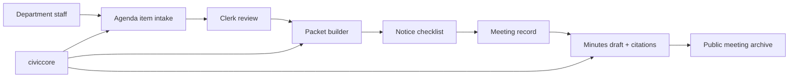

# CivicClerk User Manual

Status: scaffold manual  
Version: `0.0.0`

## Part 1: Non-Technical Overview

### What CivicClerk is

CivicClerk will help city clerks manage the legal record of public
meetings. It is planned to cover agendas, packets, notices, minutes,
votes, motions, ordinances, resolutions, and public meeting archives.

### Who it is for

- city clerks
- deputy clerks
- department staff submitting agenda items
- city attorneys reviewing legal form
- mayors, council members, board members, and commissioners
- residents and journalists viewing public meeting materials

### What a clerk should expect

The product goal is a calm workflow:

1. Create a meeting body.
2. Schedule a meeting.
3. Collect agenda items from departments.
4. Assemble and review the packet.
5. Track notice deadlines.
6. Capture motions and votes.
7. Draft minutes with source citations.
8. Publish approved materials.

Every warning should explain what is wrong and how to fix it. AI may
draft language, but staff remain in control.

### Current status

CivicClerk is not installable yet. This repository is the starting
scaffold for the module.

## Part 2: IT and Technical Overview

### Planned deployment model

CivicClerk will follow the CivicSuite deployment pattern:

- local Docker-based deployment
- PostgreSQL 17 + pgvector
- Redis + Celery
- FastAPI backend
- React frontend
- Ollama/Gemma 4 for local LLM inference through `civiccore.llm`
- no runtime cloud dependency
- no telemetry

### Planned dependency

The first runtime version should pin to civiccore `>=0.2.0,<0.3.0`.

### Security posture

- Local-first data ownership.
- Role-based access control.
- API-enforced public/private boundaries.
- Audit log for every state transition.
- Closed-session material must never leak into public views.

### Verification

This scaffold ships with:

```bash
bash scripts/verify-docs.sh
```

Runtime test gates will be added before code ships.

## Part 3: Architecture Reference

### Planned module boundaries

CivicClerk owns meeting workflows. It should not become:

- electronic voting software
- livestream hosting
- a legal decision-maker
- a full document-management system

### Initial data model sketch

- `meeting_bodies`
- `meetings`
- `agenda_sections`
- `agenda_items`
- `agenda_item_attachments`
- `packet_versions`
- `notice_requirements`
- `notice_postings`
- `motions`
- `votes`
- `minutes_drafts`
- `minute_citations`
- `public_comments`
- `adoption_events`

### Architecture sketch



### First MVP acceptance bar

- Meeting setup works end to end.
- Agenda item intake has loading, empty, success, error, and partial states.
- Notice warnings are actionable.
- Public material clearly labels draft, posted, approved, and archived states.
- Browser QA evidence exists before frontend merges.
