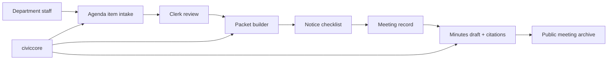

# CivicClerk User Manual

Status: CivicClerk v0.1.0 runtime foundation manual  
Version: `0.1.0`

## Part 1: Non-Technical Overview

### What CivicClerk is

CivicClerk will help city clerks manage the legal record of public
meetings. It is planned to cover agendas, packets, notices, minutes,
votes, motions, ordinances, resolutions, and public meeting archives.

### Who it is for

- city clerks
- deputy clerks
- department staff submitting agenda items
- city attorneys reviewing legal form
- mayors, council members, board members, and commissioners
- residents and journalists viewing public meeting materials

### What a clerk should expect

The product goal is a calm workflow:

1. Create a meeting body.
2. Schedule a meeting.
3. Collect agenda items from departments.
4. Assemble and review the packet.
5. Track notice deadlines.
6. Capture motions and votes.
7. Draft minutes with source citations.
8. Publish approved materials.

Every warning should explain what is wrong and how to fix it. AI may
draft language, but staff remain in control.

### Current status

CivicClerk currently ships a runtime foundation, canonical schema
metadata, Alembic migration scaffolding, agenda item lifecycle enforcement,
meeting lifecycle enforcement, packet snapshot versioning, notice
compliance enforcement, immutable motion capture, immutable vote capture,
action-item capture linked to meeting outcomes, citation-gated minutes
draft capture, and permission-aware public calendar/detail/archive
endpoints, a prompt YAML library and offline evaluation harness,
local-first connector imports for Granicus, Legistar, PrimeGov, and
NovusAGENDA, accessibility/browser QA gates, CivicClerk v0.1.0 release
artifacts, CivicCore v0.3.0-backed packet export bundles, a database-backed
agenda intake queue with clerk readiness review, and database-backed packet
assembly records with source/citation metadata, and database-backed notice
checklist/posting-proof records.
The `/staff` page now provides first staff workflow screens for agenda intake,
packet assembly, and notice checklist/posting-proof work. The agenda intake
screen can submit and review intake items through the live API. IT
staff can import and serve `civicclerk.main:app`, call `/`, call `/health`,
open `/staff`, create draft agenda items and meetings, version packet snapshots, test
allowed/rejected notice compliance postings, capture motions, capture
votes, add correction records, create action items, create minutes drafts
with sentence-level citations and prompt-version provenance, verify public
archive filtering, and run prompt evaluations with outbound network
blocked. IT staff can also import local connector export payloads while
preserving source provenance. IT staff can now generate records-ready packet
export bundles with CivicCore manifests, checksums, provenance, and
hash-chained audit evidence. Clerks can submit/list/review `/agenda-intake`
items with readiness status stored in the configured intake database. The
current `/staff` page submits and reviews agenda intake records directly;
packet assembly and notice checklist screens still show screen-level workflow
guidance and sample queues until their live browser form actions land.

## Part 2: IT and Technical Overview

### Planned deployment model

CivicClerk will follow the CivicSuite deployment pattern:

- local Docker-based deployment
- PostgreSQL 17 + pgvector
- Redis 7.2 + Celery + Celery Beat
- FastAPI backend
- React frontend
- Ollama/Gemma 4 for local LLM inference through `civiccore.llm`, selected by `CIVICCORE_LLM_PROVIDER=ollama`
- no runtime cloud dependency
- no telemetry

### Planned dependency

The runtime foundation now pins to civiccore `==0.3.0`. Agenda intake uses
`CIVICCLERK_AGENDA_INTAKE_DB_URL` when set; packet assembly records use
`CIVICCLERK_PACKET_ASSEMBLY_DB_URL` when set; notice checklist records use
`CIVICCLERK_NOTICE_CHECKLIST_DB_URL` when set. If unset, each repository uses
an in-memory SQLite database suitable for local smoke checks.

### Security posture

- Local-first data ownership.
- Role-based access control.
- API-enforced public/private boundaries.
- Audit log for every state transition.
- Closed-session material must never leak into public views.

### Verification

This runtime foundation ships with:

```bash
python -m pytest
bash scripts/verify-docs.sh
python scripts/check-civiccore-placeholder-imports.py
```

Runtime test gates now run in CI. Meeting-workflow tests are added in later milestones.
Milestone 3 adds an agenda item lifecycle test matrix covering every pair
of canonical states. Only direct forward transitions are accepted; invalid
transitions return a 4xx response and record an audit entry.
Milestone 4 adds a meeting lifecycle test matrix from `SCHEDULED` through
`ARCHIVED`, plus emergency/special notice preconditions, closed/executive
session statutory-basis preconditions, cancellation handling, and audit
entries for allowed and rejected meeting transitions.
Milestone 5 adds packet snapshot versioning and notice compliance tests for
deadline warnings, statutory-basis requirements, and public-posting human
approval. Every warning includes a concrete fix path. Milestone 6 adds
immutable motion and vote capture, append-only correction records, and
action-item capture linked to meeting outcomes. Milestone 7 adds
citation-gated minutes drafts: every material sentence needs a source
citation, provenance records model, prompt version, data sources, and human
approver, and AI drafts are never auto-adopted or auto-posted. Milestone 8
adds permission-aware public calendar, public detail, and archive search
tests that prevent closed-session leakage in anonymous response bodies,
counts, suggestions, and not-found responses. Milestone 9 adds a YAML
prompt library, prompt-version enforcement, and an offline evaluation
harness that runs with `CIVICCORE_LLM_PROVIDER=ollama` and outbound network
blocked before prompt changes merge. Milestone 10 adds local-first
Granicus, Legistar, PrimeGov, and NovusAGENDA meeting imports with source
provenance and actionable errors, without requiring outbound runtime calls.
Milestone 11 adds browser QA evidence and a CI gate for loading, success,
empty, error, and partial states plus keyboard navigation, focus states,
contrast, and console checks. Milestone 12 synchronizes version surfaces,
builds release artifacts and checksums, and publishes CivicClerk v0.1.0.
The current production-depth branch pairs CivicClerk with `civiccore==0.3.0`
so packet exports, packet assembly records, and notice checklist records can
use CivicCore manifests, provenance, checksums, and audit primitives.

## Part 3: Architecture Reference

### Planned module boundaries

CivicClerk owns meeting workflows. It should not become:

- electronic voting software
- livestream hosting
- a legal decision-maker
- a full document-management system

### Initial data model sketch

Milestone 2 defines the canonical schema and Alembic migration foundation
for these CivicClerk tables. Milestone 3 adds agenda lifecycle enforcement
for agenda items. Milestone 4 adds meeting lifecycle enforcement. Milestone
5 adds packet snapshot versioning and notice compliance enforcement.
Milestone 6 adds immutable motion capture, immutable vote capture, and
action-item capture linked to meeting outcomes. Milestone 7 adds
citation-gated minutes draft capture with provenance. Milestone 8 adds
permission-aware public archive behavior, including closed-session
filtering for anonymous and under-privileged users. Milestone 9 moves
policy-bearing prompt text into YAML and adds an evaluation harness.
Milestone 10 adds source-provenanced connector import normalization for
Granicus, Legistar, PrimeGov, and NovusAGENDA. Production-depth slices add
records-ready packet export bundles using CivicCore v0.3.0 provenance, export
manifest, checksum, and audit primitives; database-backed agenda intake and
clerk readiness review state; and database-backed packet assembly records
with source references, citations, and packet snapshot linkage; and
database-backed notice checklist records with posting-proof metadata. Public
packet exports reject closed-session and restricted source files. Full UI
screens remain planned work, but browser QA gates now verify the required
state fixtures and accessibility evidence before browser-visible changes merge.

- `meeting_bodies`
- `meetings`
- `agenda_items`
- `staff_reports`
- `motions`
- `votes`
- `public_comments`
- `notices`
- `minutes`
- `transcripts`
- `action_items`
- `packet_versions`
- `ordinances_adopted`
- `closed_sessions`

### Architecture sketch



### First MVP acceptance bar

- Meeting setup works end to end.
- Agenda item intake has loading, empty, success, error, and partial states.
- Notice warnings are actionable.
- Public material clearly labels draft, posted, approved, and archived states.
- Browser QA evidence exists before frontend merges.
